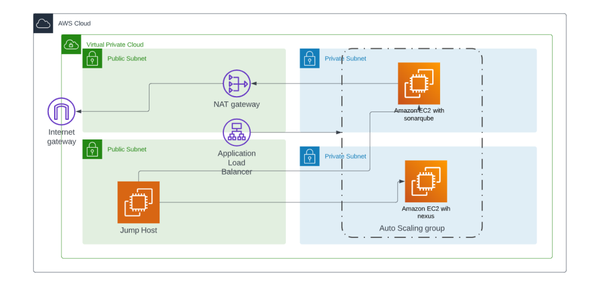
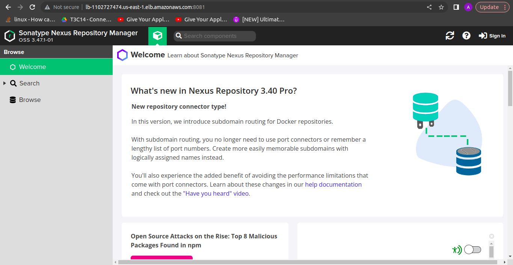
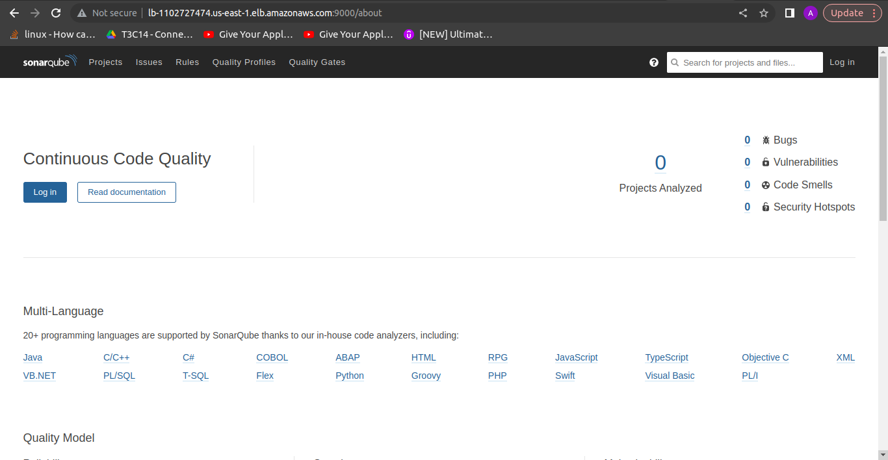

# Ansible Lab 2 

The aim of this Lab is to deal with private instance by a bastion host and use roles in ansible instead of one long playbook for better documentation

## 1- install Nexus in private Machine

- we create Nexus Role that we will customize

    ```ansible-galaxy init Nexus```

- then we customize tasks file like in the repo

## 2- install sonarqube in private Machine

-  we create sonarqube Role 

    ```ansible-galaxy init sonarqube```

- then we customize tasks file 

## 3- Build our Infra in AWS

we create our infra like this diagram with the differnace of 2 target groups for each private instance

to reach each one by the LoadBalancer using different listener for each target group



## 4- craete our inventory.ini and main Playbook

- just create it as it is created in this repo don't change any thing expect the IP address in ```ansible_host``` for public and private instance
- create the main playbook to install nexus and sonarqube one in each instance
- then edit file **~/.ssh/config** to give ansible the ability to use bastion host to access private instances
  
  ```bash
  Host bastion
        hostname 3.235.29.227
        user ubuntu
        port 22
        identityfile /home/abdelrahman/Desktop/iti/ansible/sonarqube/saif.pem
  ```

## 5- Run the playbook

- by excuting this command
  
    ```ansible-playbook PlayBook.yml -i inventory.txt```

## output

we access **Nexus** using LoadBalancer's DNS name like this ```<LoadBalancer_DNS_NAME>:8081``` in browser

the result will be:



we access **SonarQube** using LoadBalancer's DNS name like this ```<LoadBalancer_DNS_NAME>:9000``` in browser

the result will be:


